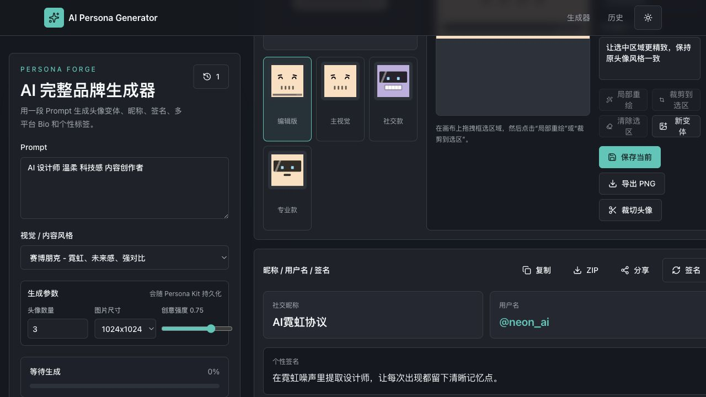

# 星格身份 Astra Persona

面向个人品牌与数字创作者的 AI 身份资产生成工作台。前端使用 Vue 3，Node API 部署在 Render，统一代理火山方舟豆包接口，API Key 不进入浏览器或前端构建产物。



## 核心能力

- 按需生成名称与用户名、头像、社交签名、个人简介和关键词标签。
- 提供完整品牌、求职主页、内容创作者和快速头像场景预设。
- 配置驱动的动态参数面板，根据资产类型展示真正进入模型指令的生成偏好。
- 统一设置使用目标、目标受众、品牌语气、输出语言与关键词约束。
- 支持头像构图、视觉媒介、风格强度，签名字数与结构，Bio 内容重点和标签构成等细粒度控制。
- 头像多变体预览、主视觉选择、单图下载和重新生成。
- Pinia 持久化生成历史，支持搜索、确认回填和生成快照。
- 导出 PNG、JSON 与完整 ZIP 品牌资产包，支持分享链接和二维码。
- 文本流式输出、请求取消、指数退避重试、客户端任务队列和进度反馈。
- PWA、路由懒加载、图片懒加载和 Web Worker 图像处理。

## 技术架构

```text
Vercel (Vue 3 SPA)
       |
       | HTTPS /api/ai/*
       v
Render (Express 5 + TypeScript)
       |
       | Bearer API Key（仅服务端注入）
       v
Volcano Engine Ark / Doubao
```

### 前端

- Vue 3.5、Composition API、`<script setup>`
- TypeScript 严格模式、Vite 8、Vue Router 4
- Pinia、pinia-plugin-persistedstate
- Tailwind CSS、Naive UI、Lucide Icons
- Fetch/Axios、JSZip、QRCode、Canvas、Web Worker、Vite PWA

### 后端

- Node.js 22、Express 5、TypeScript
- Zod 环境变量与请求校验
- Helmet、CORS 白名单、express-rate-limit
- Pino 结构化日志与敏感字段脱敏
- 文本 SSE 透传、图像生成与任务轮询代理
- `/api/health` 健康检查与 Render Blueprint

## 目录结构

```text
src/
  api/                  # Persona 业务入口与 mock/真实 AI 切换
  components/persona/   # 工作台、动态参数和资产结果卡片
  constants/            # 资产注册表、字段定义、场景预设与默认值
  components/ui/        # 项目级通用 UI 组件
  composables/          # 可复用组合式逻辑
  services/             # AI、导出、分享、Worker 客户端
  stores/               # Pinia 应用状态
  types/                # Persona 领域类型
  workers/              # 图像处理 Web Worker
server/
  config/               # 服务端环境变量校验
  lib/                  # Provider、日志、错误模型
  middleware/           # 404 与统一错误处理
  routes/               # 健康检查和 AI 代理路由
render.yaml             # Render 自动部署配置
```

## 本地运行

环境要求：Node.js 22.12+、pnpm 8+。

```bash
nvm use
pnpm install
cp .env.example .env.local
cp server/.env.example server/.env
```

在 `server/.env` 中设置火山方舟密钥：

```env
ARK_API_KEY=your_volcengine_ark_api_key
ARK_TEXT_MODEL=doubao-seed-2-0-pro-260215
```

分别启动后端和前端：

```bash
pnpm server:dev
pnpm dev
```

- 前端：`http://localhost:5173`
- API 健康检查：`http://localhost:3000/api/health`
- 本地 `/api` 请求由 Vite 代理到 Node 服务。

关闭真实 AI 时，可在 `.env.local` 设置 `VITE_USE_REAL_AI=false` 使用确定性 mock 数据。

## 环境变量

### Vercel 前端

```env
VITE_API_BASE_URL=https://your-service.onrender.com
VITE_USE_REAL_AI=true
VITE_ENABLE_REAL_IMAGE=false
VITE_AI_TEXT_RESPONSE_FORMAT_ENABLED=false
VITE_AI_REQUEST_TIMEOUT_MS=120000
```

所有 `VITE_` 变量都会进入浏览器，严禁在其中存放 API Key。

### Render 后端

```env
CORS_ORIGINS=https://your-project.vercel.app
ARK_API_KEY=your_volcengine_ark_api_key
ARK_BASE_URL=https://ark.cn-beijing.volces.com/api/v3
ARK_TEXT_MODEL=doubao-seed-2-0-pro-260215
ARK_TEXT_CHAT_PATH=/chat/completions
AI_REQUEST_TIMEOUT_MS=120000
```

图像能力为可选项，配置项见 [`server/.env.example`](./server/.env.example)。`doubao-seed-2-0-pro-260215` 是文本模型；未配置图像模型时，头像使用项目内置的本地变体回退。

## 部署

### 1. Render API

1. 将仓库连接到 Render，选择 **New Blueprint Instance**。
2. Render 会读取根目录的 `render.yaml` 创建 `astra-persona-api`。
3. 填写 `CORS_ORIGINS`、`ARK_API_KEY`；图像服务未接入时，其余图像变量可留空。
4. 部署完成后访问 `/api/health`，确认 `textGeneration` 为 `true`。

### 2. Vercel 前端

1. 在 Vercel 项目环境变量中设置 `VITE_API_BASE_URL` 为 Render 服务根地址。
2. 设置 `VITE_USE_REAL_AI=true`，并移除旧的 `VITE_AI_TEXT_API_KEY` 等浏览器密钥。
3. 触发一次 Redeploy。此后 GitHub 分支有新提交时，Vercel 与 Render 都会自动构建部署。

## 质量检查

```bash
pnpm type-check
pnpm server:type-check
pnpm build
pnpm server:build
```

## 生产优化建议

- Render 免费实例在空闲后会休眠，正式用户场景建议升级常驻实例以消除冷启动。
- 增加用户登录、服务端额度和调用审计，将限流从 IP 维度升级为用户维度。
- 使用 Redis/BullMQ 承载耗时图像任务，并通过 SSE 或 WebSocket 推送任务进度。
- 分享内容改为服务端持久化短链接，历史资产迁移到 PostgreSQL + 对象存储。
- 上线前补充真实 `og:image`，并完成移动端交互与 Lighthouse 回归。
